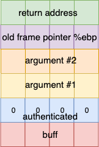

# ovf - an example buffer overflow

look at the code:

```
int main(int argc, char *argv[]) {
	int authenticated = 0;

	char buffer[4];

    // copy argument string to buffer
	// with unsafe string copy func
	strcpy(buffer, argv[1]);

	if (authenticated) {
		printf("user is authenticated!");
	}
}
```

It is writing an arbitrary amount of data from the program's arguments to the buffer 'buffer' which is 4 bytes long. Note that if you write 5, you will become authenticated - why?

The program writes upwards on the stack and ends up overwritting our authentication flag!

This is a dangerous buffer overflow!

